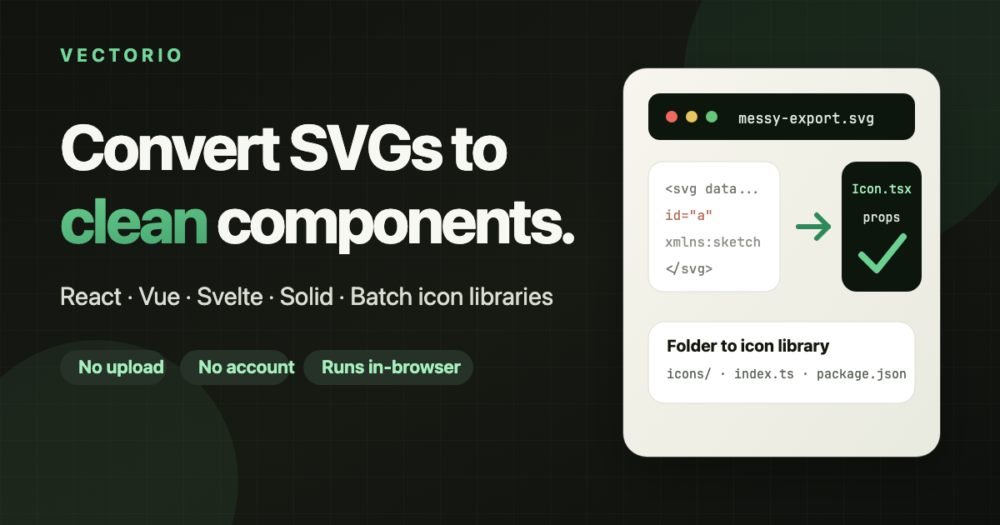
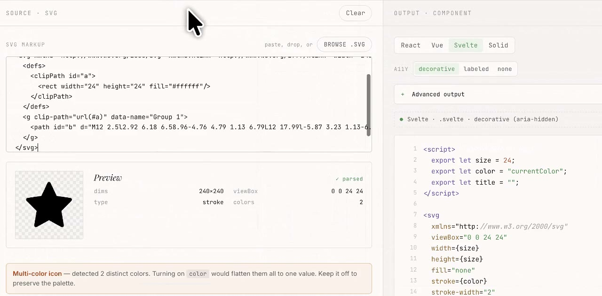
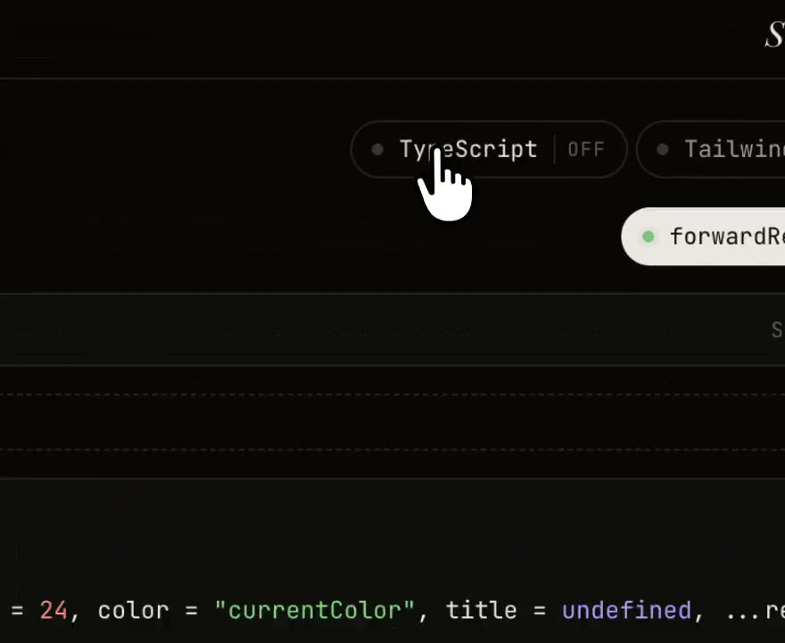
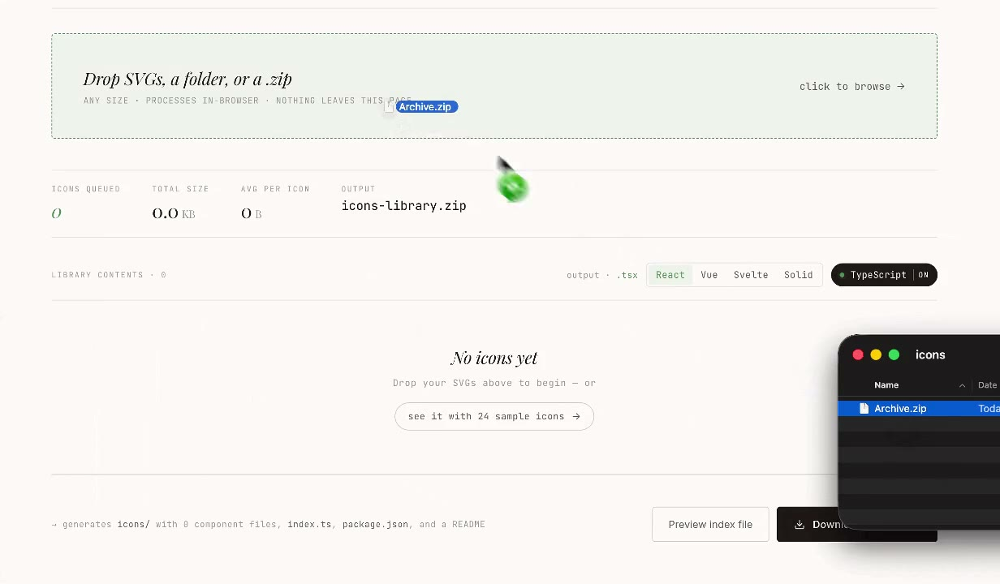

<div align="center">

# Vectorio

**Convert SVGs into clean components.**

Multi-framework SVG-to-component generator with batch folder-to-library mode. React, Vue, Svelte, Solid — strips Figma/Sketch export junk, fixes ID collisions, generates a tree-shakable icon library with `package.json` and README. Runs entirely in your browser.

[**Try it at vectorio.app →**](https://vectorio.app)



</div>

---

## See it in action

<table>
<tr>
<td width="33%" align="center">
  <a href="https://vectorio.app/convert">
    
  </a>
  <br>
  <strong>One paste, four frameworks</strong>
  <br>
  <sub>React, Vue, Svelte, Solid — same input</sub>
</td>
<td width="33%" align="center">
  <a href="https://vectorio.app/convert">
    
  </a>
  <br>
  <strong>Output you can ship</strong>
  <br>
  <sub>TypeScript, Tailwind, a11y, forwardRef</sub>
</td>
<td width="33%" align="center">
  <a href="https://vectorio.app/batch">
    
  </a>
  <br>
  <strong>A folder in. A library out.</strong>
  <br>
  <sub>Drop a zip, get a tree-shakable package</sub>
</td>
</tr>
</table>

> Click any thumbnail to open the live tool. Animated demos play on the landing page at [vectorio.app](https://vectorio.app).

---

## Why Vectorio

Most tools give you a single React component. Vectorio gives you four frameworks, a real cleanup pass, and a whole library.

Design exports come with production noise — vendor namespaces, `data-*` attrs, duplicate gradient IDs, hard-coded dimensions, fills that should be `currentColor`. Vectorio is the place to inspect, clean, convert, share, and package those files before they enter your repo.

**Use it when you need to:**

- Convert one SVG into a clean component without setting up a build pipeline
- Compare React, Vue, Svelte, and Solid output from the same source
- Strip Figma / Sketch export junk while preserving self-contained behavior
- Prefix IDs so gradients, masks, and filters don't collide across icons
- Generate a zip-ready icon library from a folder or `.zip`
- Share a reproducible converter state via URL hash (no upload)

**Skip it when:** you already have an SVGR pipeline locked into your repo and the conversion rules are settled. Vectorio is for the *before* state.

---

## Features

### Converter
- Paste, drop, or browse an SVG → live preview + clean component
- React, Vue, Svelte, Solid — switch with one tab
- Optional **TypeScript** and **Tailwind** output
- Auto-detected props: `color`, `size`, `strokeWidth` (toggle each)
- A11y modes: `decorative` / `labeled` / `none`
- React `forwardRef`, `memo`, default exports, prefix / suffix
- Share via URL — entire converter state encoded in the hash, never sent to a server

### Batch
- Drop a folder or `.zip` → preview every icon in a gallery
- Filter by name, folder, or component name
- Per-icon copy / download / remove actions
- Bulk rename (strip prefix, add prefix, add suffix)
- Auto-namespace duplicate names by folder (`Arrow` from `outline/` and `solid/` become `ArrowOutline` / `ArrowSolid`)
- Download as a zip with one component file per icon, a barrel `index`, `package.json`, and README

### Cleaning
- Removes XML prolog, vendor namespaces (`xmlns:sketch`, `xmlns:figma`), `data-*` attrs, comments
- Strips empty groups and unused defs
- Prefixes referenced IDs (`url(#a)` → `url(#prefix-a)`) so gradients, masks, clipPaths don't collide on a multi-icon page
- Detects multicolor icons and disables the `color` prop so the palette stays intact
- Hard-coded `width` / `height` become props instead of being inlined

---

## Quick start

The fastest path is the live app — no install:

> [vectorio.app](https://vectorio.app)

To run it locally:

```bash
git clone https://github.com/berkinduz/vectorio.git
cd vectorio
npm install
npm run dev
```

Build for production:

```bash
npm run build
```

Run all checks:

```bash
npm run lint
npm test
npm run build
npm run smoke
```

---

## Stack

Vite · React 19 · JSZip · Vanilla CSS · No backend

The whole app is a static SPA. SVG parsing, cleanup, code generation, share-link encoding, and zip packaging all happen in the browser.

---

## Privacy

- **No upload.** SVGs never leave the page.
- **No account.** Open the URL and start using it.
- **Privacy-respecting analytics.** Aggregate pageviews via Umami (Do-Not-Track honored, no fingerprinting, no SVG content tracked).
- **Share links stay in the hash.** URL fragments aren't sent to servers in normal HTTP requests.

---

## Roadmap

- [ ] Optional SVGO-powered optimization mode
- [ ] CLI / npm package for repo automation
- [ ] Animated icon support (CSS keyframes from `<animate>` tags)
- [ ] More framework targets (Lit, Qwik)

---

## Contributing

Bug reports, feature requests, and PRs welcome. The fastest path:

1. Open an [issue](https://github.com/berkinduz/vectorio/issues) — include the smallest SVG that reproduces the behavior
2. For PRs, run `npm run lint && npm test && npm run build && npm run smoke` before pushing

---

## License

MIT © [Berkin Düz](https://github.com/berkinduz)

If Vectorio saved you time, you can [buy me a coffee](https://buymeacoffee.com/berkinduz) ☕
